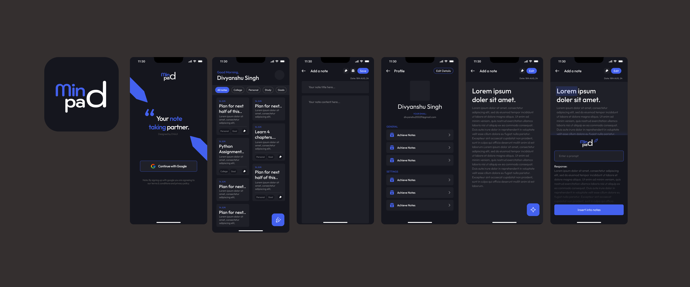

# MindPad - Minor Project Design

This repository contains the code for **MindPad**, a note-taking application. The design for this project was created in Figma.

---

### Key Features
* **User Authentication**: Secure sign-up and login.
* **Note-Taking**: Create, edit, and delete notes.
* **Tagging**: Organize notes with custom tags.
* **Search**: Quickly find notes with an integrated search bar.
